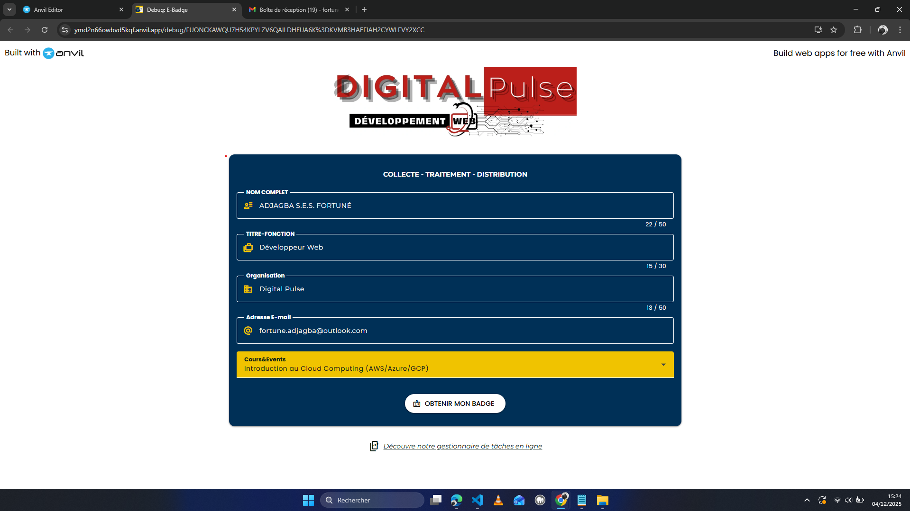
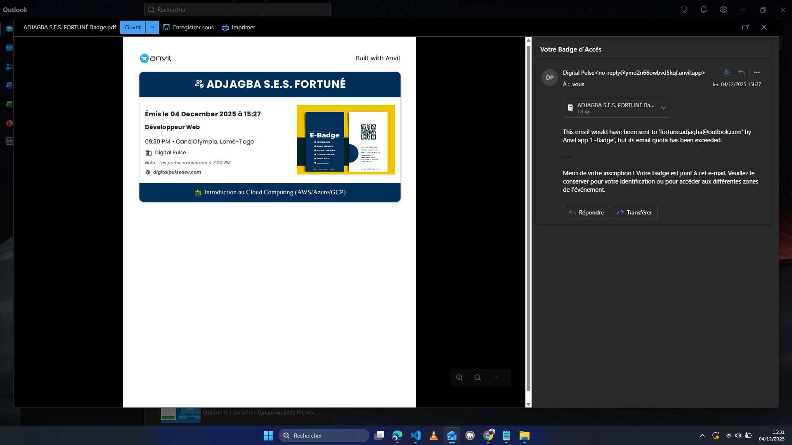

🇫🇷 [Version française] | 🇬🇧 [English version](README.en.md)


<h2 align="center" id="title">E-Badge <br> Génération de billets PDF avec Python (Anvil)</h2>

<p id="description">Application web développée avec Python via Anvil, permettant à un utilisateur de s’inscrire à un événement, puis de générer automatiquement un billet électronique (E-Badge) au format PDF, téléchargeable et envoyé par e-mail.</p>

<h2>Aperçu de l’application</h2>

 <br>
 <br>

<h2>Demo</h2>

[https://demo/e-badge](https://altruistic-squeaky-blue-sheep.anvil.app)

<h2>Objectif du projet</h2>

*   Générer un billet PDF dynamique à partir d’un formulaire Anvil
*   Télécharger automatiquement le ticket
*   Envoyer le billet par e-mail au participant
*   Vérifier les champs saisis avant validation

<h2>Fonctionnalités principales</h2>

*   Formulaire d’inscription (nom, fonction, organisation, mail)
*   Validation des champs
*   Génération automatique d’un PDF
*   Téléchargement du billet
*   Envoi du billet par e-mail
*   Nom de fichier PDF personnalisé

<h2>Cloner et utiliser le projet dans Anvil :</h2>

Méthode officielle (la plus simple)

<p>1. Ouvre ton compte Anvil :</p>

```
https://anvil.works/
```

<p>2. Depuis le Dashboard :</p>

```
Sous Create a new new app
```

<p>3. Clique sur :</p>

```
Clone from GitHub
```

<p>4. Colle l’URL du dépôt GitHub :</p>

```
https://github.com/adjagbafortune/e-badge_projet.git
```

<p>5. Clique sur Clone App :</p>

Le projet est immédiatement prêt à être modifié et exécuté dans Anvil.


<h2>Lancer l’application</h2>

*   Clique sur Run
*   Remplis le formulaire
*   Clique sur obtenir mon badge
*   Le billet PDF sera :
    *   téléchargé
    *   et envoyé par e-mail

<h2>Construit avec</h2>

Technologies utilisées dans ce projet :

*   Python
*   Anvil Framework
*   anvil.pdf
*   anvil.email
*   Anvil Server Modules
*   Anvil UI (Forms)

<h2>🛡️ License</h2>

Projet sous [License MIT](LICENSE)
